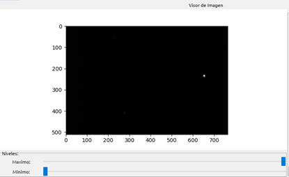
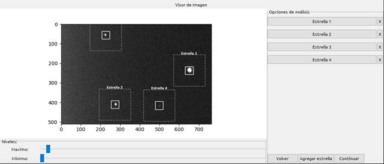
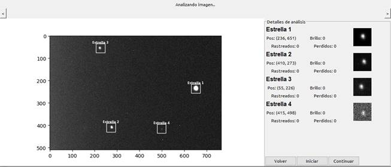
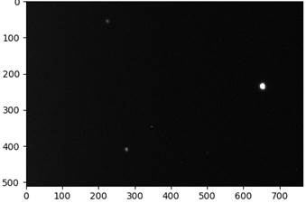
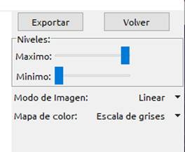
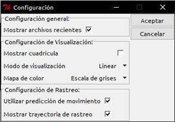
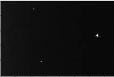
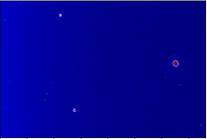
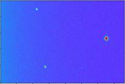
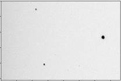

# StarTrak

Software utilizado para la deteccion y rastreo de estrellas variables

## Requisitos
Se necesitan los siguientes modulos de python:
- Python 2.7
- TKinter
- NumPy
- PyFITS

## Instalacion y primer uso

- Descaragar o Clonar el repositorio
- Instalar los paquetes:
>pip3 install numpy
>pip3 install matplotlib
>pip3 install astropy
>pip3 install pillow
>pip3 install scipy

En Linux puede ser necesario instalar tcl/tk manualmente:
>apt-get update
>apt-get install python3-tk

- En la carpeta contenedora, escribir
>python STCore/Main.py

*Debe ser se este modo para que se hagan referencias a las carpetas del programa*

- En el Menu se puede elegir si se quiere comenzar un analisis en tiempo real o Abrir varios ficheros FITS para un analisis conjunto.

---

## Guia de usuario

### Indice
1. [¿Qué es StarTrak?](#about)
2. [¿Cómo utilizar el software?](#usage)
3. [Selección de estrellas y parámetros](#starsel)
4. [Rastreo](#track)
5. [Gráfico y datos](#plot)
6. [Composición](#comp)
7. [Opciones](#settings)
8. [Preguntas frecuentes](#faq)

#### ¿Qué es StarTrak? 
StarTrack es un sofware creado por alumnos de la Universidad de Valparaiso con el fin de analizar visualmente estrellas variables y crear composiciones de imágenes utilizando el rastreo de estrellas

#### ¿Cómo utilizar el software? 
**Selección de archivos**

Para seleccionar archivos se debe hacer clic en "Agregar archivos" y luego seleccione las imágenes que se quieran analizar.
Además se pueden descartar archivos que el usuario considere incompletos o no relevantes para el análisis de los datos, una vez finalizado se debe hacer clic en continuar.

 
 #### Seleccion de estrellas y parámetros 
 
Una vez seleccionados los archivos puede continuar a la sección de selección de estrellas, donde podrá ver los siguientes elementos:
**Barras de Niveles**: Estas barras controla la visibilidad de la imagen tanto como el contraste para facilitar la identificación de estrellas

 
 
 
 **Barra lateral**:  Contiene un panel para ver y editar las estrellas, así como para agregar nuevas estrellas y moverse entre las diferentes pantallas.
 
 
 
Para modificar una estrella simplemente haga clic en el nombre que aparece en la lista. Para eliminar una estrella presione la “X” al lado del nombre
También puede modificar la posición de una estrella arrastrando el cursor sobre ella en el Visor de imágenes.

##### Selección de estrellas

Para seleccionar una estrella simplemente haga clic in la imagen donde se encuentra la estrella, o presione el botón “Añadir estrella” en la barra lateral. Aparecerá una ventana como ésta con las siguientes opciones:

**Nombre de la estrella**: Da un nombre a la estrella para identificarla.          
**Posición**: Ajusta la posición de la estrella por píxel utilizando las coordenadas de la imagen (+X derecha, +Y abajo).
**Tamaño de la estrella**: Ajusta el tamaño visual de la estrella para ayudar con la identificación y el análisis.
**Radio de búsqueda**: Es un estimado de la distancia máxima que se puede mover la estrella antes que el rastreador la pierda.
**Tolerancia de búsqueda**: Es un estimado de la cantidad máxima que una estrella puede variar su brillo antes que el rastreador la pierda

Ya terminado el proceso de selección, se pueden ajustar los valores en el panel de la derecha, tanto como para editar o borrar completamente lo seleccionado. Una vez listo, se presiona el botón "Continuar".

## Rastreo 

El rastreo de StarTrak funciona localizando en cada imagen las estrellas seleccionadas, para iniciar este proceso haga clic en “Iniciar” el rastreo se hará automáticamente. La ventana cuenta con los siguientes elementos:

**Botones de búsqueda**: Una vez terminado el proceso de rastreo utilice estos botones para navegar entre las imágenes para inspeccionar y revisar las estrellas rastreadas.

**Visor de rastreo**: En esta ventana puede ver las estrellas que fueron rastreadas. Las estrellas que el rastreador ha perdido aparecerán en rojo, en este caso usted puede modificar los puntos rastreados arrastrando el cursor sobre las estrellas.

|
 
*Si el rastreo falla para una estrella, el marcador se pondra rojo*

**Barra lateral**: Esta barra contiene información sobre las estrellas y los puntos rastreados, así como los puntos que el rastreador haya perdido.

Una vez terminado presione el botón "Continuar" para analizar las magnitudes o crear una composición.

#### Gráfico y datos 

Para comenzar el análisis grafico primero se debe configurar el tipo de grafico que se quiere tener, en la ventana de configuración podrá ver las siguientes opciones:

**Ordenar datos**: Esta opción sirve para mostrar los datos según la fecha de la imagen, o según e nombre de las imágenes y tener un gráfico igualmente espaciado.

**Eliminación de datos**: Sirve para eliminar automáticamente los datos perdidos por el rastreador o aquellos que se desvían de la magnitud inicial utilizando la tolerancia de cada estrella.

**Numero de etiquetas**: Ajuste este valor para lograr una cantidad óptima de información en el grafico

**Estrella de referencia**: Esta opción sirve para mostrar las magnitudes aparentes en relación a una estrella elegida por el usuario y su respectiva magnitud aparente.

Para continuar pulse “Analizar”, los datos de la configuración serán guardados con el archivo
La creación del gráfico es automática, dependiendo de la cantidad de datos, esto puede tardar unos minutos.
Una vez listo se puede guardar el gráfico o exportar los datos en un archivo de texto o un documento PDF

#### Composición 

Usted puede crear una composición de imágenes usando StarTrak, para ello simplemente presione el botón “Continuar” y después “Componer Imagen” al terminar un rastreo. Para continuar necesitara al menos dos estrellas rastreadas.

Una composición consiste en sobreponer una secuencia de imágenes de manera de aumentar la exposición y la magnitud límite de éstas, StarTrak utiliza los datos de rastreo para calibrar el movimiento de las imágenes para luego sobreponerlas.

 

En la pantalla de composición usted verá las siguientes opciones:

**Niveles**: Esta opción al igual que en el Visor de Imágenes sirve para mejorar el brillo y el contraste de la imagen final.

**Modo de Imagen**: Con esta opción puede configurar que función de color se usará para mostrar la imagen, no tiene relación con el Modo de Imagen en la ventana de Configuración

**Mapa de color**: Permite cambiar la visualización de la imagen utilizando colores para enfatizar detalles

#### Opciones 

Usted puede configurar la manera en la que StarTrak muestra sus archivos y cómo rastrea las estrellas
Para abrir el menú de opciones vaya a la barra superior y haga clic en “Archivo > Opciones”
 

**Configuración General**: Controla los aspectos más básicos de StarTrak, como mostrar la lista de archivos recientes en la pantalla de inicio

**Mostrar Cuadricula**: Permite alternar la cuadricula en el Visor de Imagen o en el Rastreador para usarlos como guías *(Requiere re-dibujar la ventana de seleccion)*

**Modo de Imagen**: Con esta opción puede configurar que función de color se usará para mostrar la imagen

Linear|Raíz Cuadrada|Logaritmo
-----|---------------|----------
||

**Mapa de color**: Permite cambiar la visualización de la imagen utilizando colores para enfatizar detalles

Escala de grises|Temperatura
----------------|-----------
|
Arcoiris|Negativo
|

#### Preguntas Frecuentes 

- El rastreador pierde muy seguido una estrella, ¿Qué debo hacer?
>Para solucionar este problema hay que volver a la pantalla Visor de Imagen y ajustar el radio de búsqueda o la tolerancia de la estrella, este ultimo debe incluir todas las variaciones de brillo que tendrá la estrella

- ¿Por qué hay mucho ruido en mi análisis?

> Esto puede ser causado por errores en la imagen las cuales pueden ser identificadas y descartadas en la pantalla de selección de imagen. También puede reducir el tamaño de la estrella para obtener mediciones de la magnitud mas precisas

- ¿Cómo exporto las magnitudes de las estrellas a Excel?

> Puede  exportar los datos del análisis una vez que se haya creado el gráfico, haga clic en “Exportar > Exportar datos”, luego en Excel puede abrir el archivo de texto o copiarlo dentro del documento

- ¿Se puede abrir archivos de StarTrak en otro computador?

> No por el momento, ya que las imágenes que son referenciadas en un archivo de StarTrak tienen rutas absolutas por ejemplo “C://Users/MiUsuario/MiCarpeta/Datos.trak”. Esto quiere decir que las rutas a los archivos serán distintas en otros computadores
